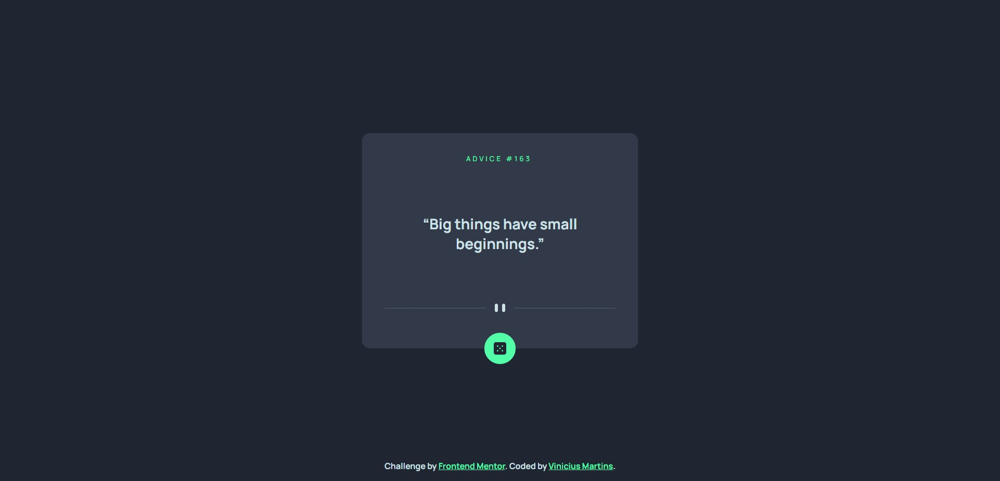

# Documentação em Português
[PT-BR](https://github.com/viniciussnitram/advice-generator-app/blob/main/README-ptBr.md)

# Frontend Mentor - Advice Generator App Solution

This is a solution to the [Advice generator app challenge on Frontend Mentor](https://www.frontendmentor.io/challenges/advice-generator-app-QdUG-13db). Frontend Mentor challenges help you improve your coding skills by building realistic projects.

## Table of contents

- [Overview](#overview)
  - [The challenge](#the-challenge)
  - [Screenshot](#screenshot)
  - [Links](#links)
- [My process](#my-process)
  - [Built with](#built-with)
  - [What I learned](#what-i-learned)
  - [Continued development](#continued-development)
- [Author](#author)
- [Acknowledgments](#acknowledgments)

## Overview

### The challenge

Users should be able to:

- ✅ View the optimal layout for the app depending on their device's screen size;
- ✅ See hover states for all interactive elements on the page;
- ✅ Generate a new piece of advice by clicking the dice icon;
- ✅ Copy the advice to the clipboard (this is an extra challenge, I found it interesting to add).

### Screenshot



### Links

- Frontend Mentor Solution URL: [Frontend Mentor Solution](https://your-solution-url.com)
- Solution URL: [Github Pages](https://viniciussnitram.github.io/advice-generator-app/)

## My process

### Built with

- HTML5
- CSS
- Flexbox
- Mobile-first
- [Axios](https://axios-http.com/ptbr/) - JS library based in promises.
- [Advice Slip JSON API](https://api.adviceslip.com/) - Advice API.

**Note: These are just examples. Delete this note and replace the list above with your own choices**

### What I learned

I learned how to perform an API request with Axios.

```js
  const url = 'https://api.adviceslip.com/advice';

  async function showAdvice() {
      const response = await axios.get(url);
      id.textContent = response.data.slip.id;
      advice.textContent = `\u{201C}${response.data.slip.advice}\u{201D}`;
  }
```

### Continued development

I want to improve my skills about API and next challenges will be in ReactJS.

## Author

- Frontend Mentor - [@ViniciusAlba](https://www.frontendmentor.io/profile/ViniciusAlba)
- Twitter - [@viniciusnitram](https://www.twitter.com/viniciusnitram)

## Acknowledgments

- Acknowledgment to He4rt Developers, an amazing community [He4rt Developers](https://heartdevs.com/);
- Acknowledgment to Iuri Code and your eBook "eFront", an eBook about Frontend [Iuri Code](https://iuricode.com/efront/);
- Acknowledgment to FreeCodeCamp [FreeCodeCamp](https://www.freecodecamp.org/);
- Acknowledgment to MDN Web Docs [MDN Web Docs](https://developer.mozilla.org/en-US/).